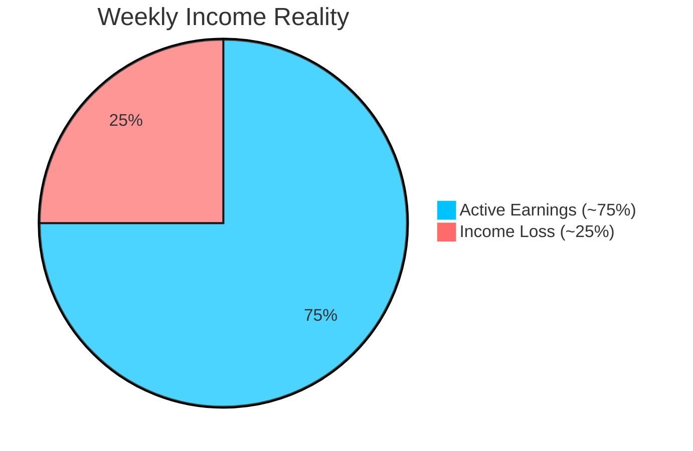

<b>Understanding the Problem</b> 
<i>Income instability in e-commerce delivery work</i>

---

# 📌 Problem Statement

E-commerce platforms like Amazon and Flipkart rely heavily on delivery partners.

But their income isn’t fixed.

They earn **per delivery**, which means:

👉 No deliveries = No income

---

### ⚠️ The reality

Everyday conditions can suddenly stop their work:

- 🌧 Rain & floods  
- 🌡 Extreme heat  
- 🌫 Pollution  
- 🚧 Local restrictions  

When this happens, deliveries slow down or stop.

---

### 💸 The impact

- Income can drop by **20–30% in a week**  
- No compensation for missed days  
- No financial safety net  

Despite being essential, delivery workers remain financially vulnerable.

---

---

# Why This Matters

India’s gig economy is growing fast — and e-commerce delivery is at its core.

- Over **37 lakh (3.7 million) workers** are already employed in e-commerce delivery alone  
- India’s total gig workforce has crossed **1.2 crore (12 million)** and is expected to reach **23.5 million by 2030**  
- Nearly **40% of gig workers earn below ₹15,000/month**, highlighting income instability  

---

### 📦 The Reality for E-commerce Workers

Delivery partners working with platforms like Amazon, Flipkart, and others depend heavily on **daily completed deliveries** for income.

This means:

👉 Even **1–2 days of disruption** can significantly impact their weekly earnings  

---

### ⚠️ The Hidden Risk

External factors like:

- Floods & heavy rainfall  
- Extreme heatwaves  
- Severe pollution  
- Government restrictions  

can instantly **reduce or stop deliveries**, leaving workers with little to no income for those days.

---

### 💡 The Gap

Despite being a critical part of the e-commerce supply chain:

- There is **no structured income protection system**  
- Earnings remain **highly volatile and unpredictable**  

---

ShieldGig aims to bridge this gap by creating a **data-driven financial safety net** using automated parametric insurance.