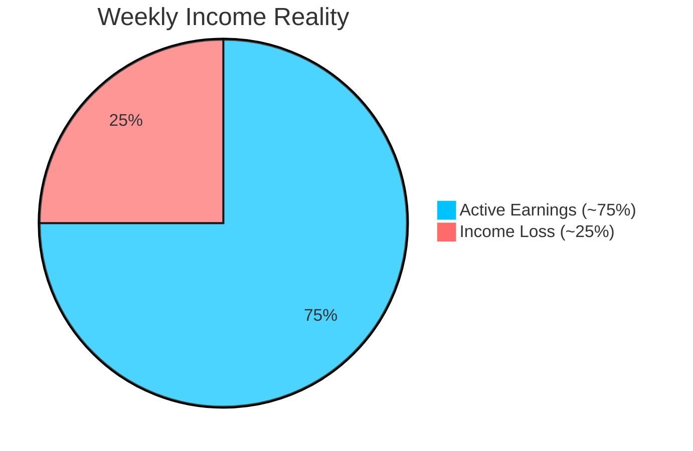

<b>Understanding the Problem</b> 
<i>Income instability in e-commerce delivery work</i>

---

# 📌 Problem Statement

E-commerce platforms like Amazon and Flipkart rely heavily on delivery partners for last-mile delivery.

But their income isn’t fixed.

They earn **per delivery**, which means:

👉 No deliveries = No income  

---

### ⚠️ The reality

Everyday conditions can suddenly stop their work:

- 🌧 Rain & floods  
- 🌡 Extreme heat  
- 🌫 Pollution  
- 🚧 Local restrictions  

When this happens, deliveries slow down or stop entirely.

---

---

### 💸 The impact

- Income can drop by **20–30% in a week**  
- No compensation for missed days  
- No financial safety net  

Despite being essential, delivery workers remain financially vulnerable.