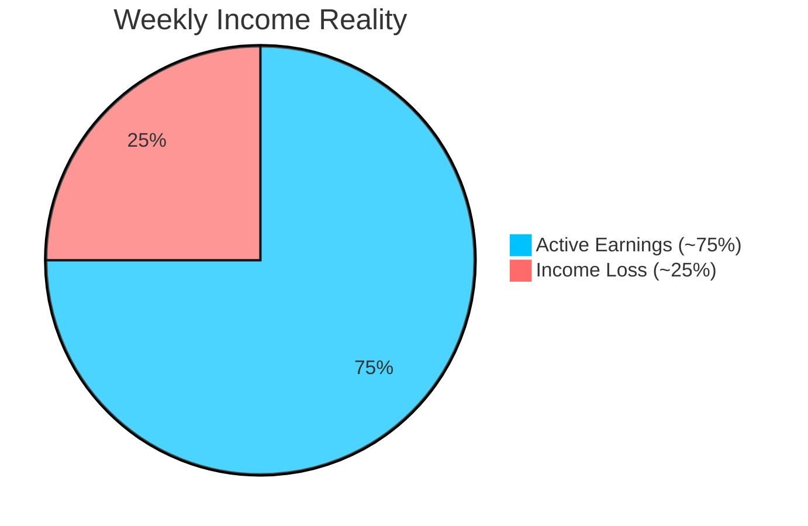
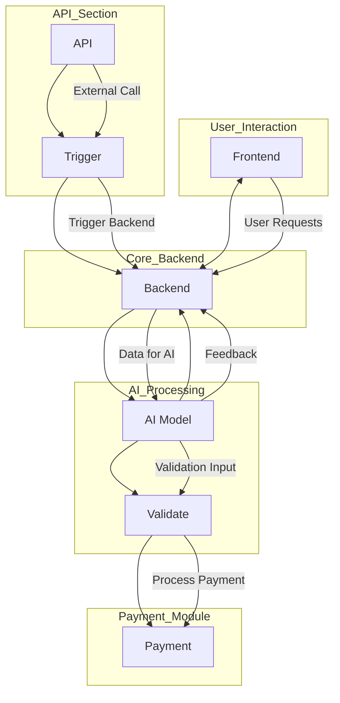
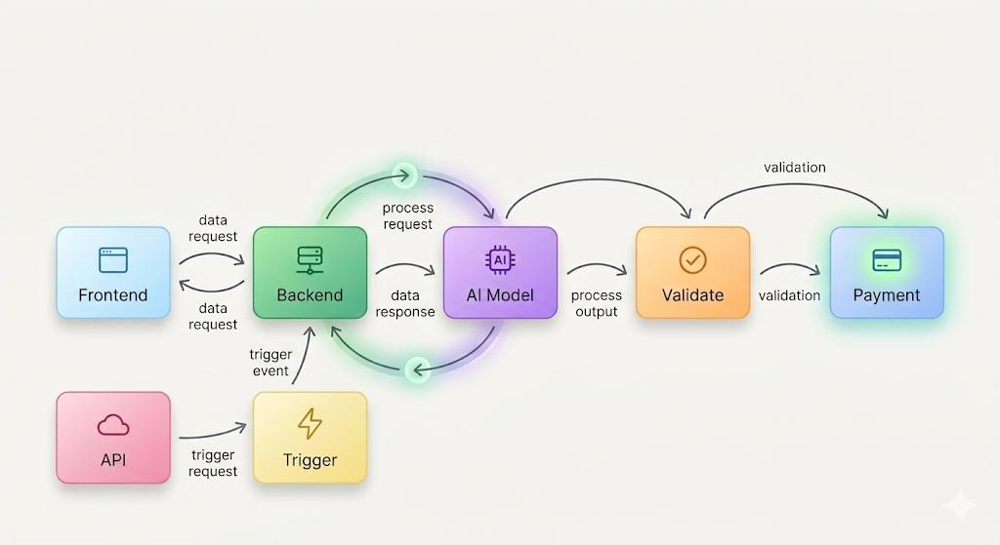
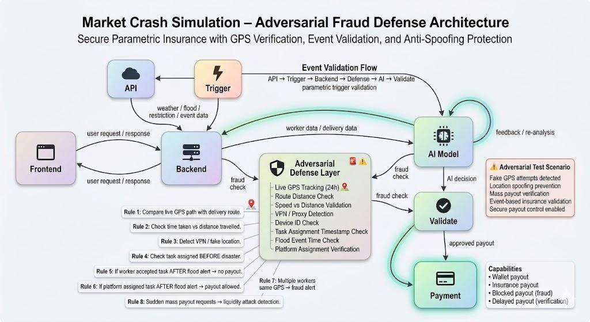

<b>Understanding the Problem</b> 
<i>Income instability in e-commerce delivery work</i>

---

# 📌 Problem Statement

E-commerce platforms like Amazon, Flipkart, Swiggy, Blinkit, and Zepto rely heavily on gig delivery partners for last-mile delivery.

These workers are paid per task, so their income depends completely on the number of deliveries they complete each day.

Because of this, their earnings become unstable when external conditions interrupt delivery operations.

👉 No deliveries = No income  
👉 Fewer deliveries = Reduced earnings  

---

### ⚠️ Real-World Disruptions

Delivery work can suddenly stop due to conditions that workers cannot control:

- 🌧 Heavy rain, floods, or storms  
- 🌡 Extreme heat affecting safe working hours  
- 🌫 High pollution levels or health alerts  
- 🚧 Government restrictions, curfews, or road blocks  
- ⚙️ Platform downtime or operational issues  

When these events happen, delivery partners lose income even though the disruption is not their fault.

---

### ⚠️ Current Problem

Existing insurance systems are not suitable for gig workers because:

- Claims require manual proof  
- Approval takes time  
- Small income losses are not covered  
- Fraud and false claims are difficult to verify  
- Platforms cannot automatically validate real disruptions  

Because of this, gig workers currently have **no reliable income protection system** during unexpected events.

---

---

# Why This Matters

India’s e-commerce industry is growing rapidly, and delivery partners play a critical role in last-mile logistics for platforms like **Amazon, Flipkart, and other online marketplaces**.

- Lakhs of delivery partners depend on **per-delivery earnings**, which means their income is not fixed  
- Even **1–2 days of disruption** due to external conditions can reduce their weekly income significantly  
- Events like **heavy rain, floods, extreme heat, road restrictions, or platform downtime** can suddenly stop deliveries  
- These situations are not in the worker’s control, but they directly affect their earnings  

Currently, there is **no reliable automated income protection system** for e-commerce delivery workers.

ShieldGig aims to solve this by creating a **data-driven parametric insurance system** that automatically verifies real-world events, validates worker activity using GPS and APIs, and provides fair compensation when deliveries are disrupted.

---

# ⚡ Parametric Triggers

ShieldGig automatically monitors **measurable thresholds** and releases payouts when workers are affected by external disruptions.

- **Rainfall & Floods** 🌧 — triggers payouts if rainfall exceeds a set limit or flood alerts are issued in the delivery zone  
- **Extreme Heat** 🌡 — activates when temperatures rise above safe working thresholds for multiple hours  
- **Air Pollution** 🌫 — triggers compensation if AQI crosses unhealthy levels in affected regions  
- **Local Restrictions & Curfews** 🚧 — automatically compensates workers if government-imposed restrictions prevent deliveries  
- **Operational Downtime** ⚙️ — monitors delivery platform or route disruptions and triggers payouts for lost income  
- **AI Verification & Fraud Detection** 🤖 — confirms worker activity and validates eligibility, preventing false claims  
- **Automatic Wallet Credit** 💳 — payouts are instantly credited to the worker’s digital wallet  

---

# 🛡️ Proposed Concept: ShieldGig

ShieldGig is a **parametric micro-insurance platform** for e-commerce delivery gig workers.  
It provides **automatic payouts** when external disruptions affect earnings, without any manual claim process.

- Uses **environmental triggers** like heavy rain, floods, extreme heat, pollution, or local restrictions  
- **AI verifies worker activity** in the affected zone before releasing payouts  
- **Fraud detection** prevents misuse, ensuring fair and accurate compensation  
- **Automatic credit** of payouts reduces income instability for workers  

---

# Workflow Scenario: E-commerce Delivery Gig Workers

## Example Case

Worker: Priya, a delivery partner in Mumbai  
Weekly Earnings: ₹7,000  

Incident: Heavy rainfall floods her delivery zone for 3 days, causing ₹2,500 income loss  

**Weather API Detection:**  
Real-time monitoring detects extreme rainfall above the defined threshold.

**Parametric Trigger:**  
The system validates that Priya’s delivery zone meets the payout conditions.

**AI Validation:**  
AI verifies her activity data to confirm she was assigned deliveries and affected by the disruption.

**Fraud Prevention:**  
System checks for anomalies to prevent misuse.

**Automatic Payout Initiation:**  
The platform calculates compensation based on expected income loss.

**Instant Compensation:**  
Priya receives ₹1,800 in her digital wallet automatically.

No manual claim required – payouts are fully automated.

---

# Visual System Workflow

---

# System Architecture

## Architecture Components

**Client Interface:**
- Delivery partner dashboard
- Policy enrollment
- Coverage status tracking
- Live activity monitoring

**Backend Node:**
- Policy management
- Worker activity tracking
- API polling
- Event monitoring
- Assignment timestamp tracking
- Payout processing control

**Defense Layer:**
- GPS validation
- Route distance check
- Speed vs distance verification
- VPN / proxy detection
- Device ID verification
- Duplicate request detection
- Assignment time verification
- Event time verification
- Fraud prevention checks

**Risk Engine:**
- Calculates geographic risk score
- Predicts disruption probability
- Uses historical weather data
- Identifies flood-prone zones
- Determines dynamic premium pricing
- Determines payout amount

### Data Oracles

**External data sources:**
- Weather API
- Flood alert API
- Government restriction alerts
- AQI / pollution APIs
- Maps / location API
- Platform delivery data API

**AI Agent:**
- Fraud detection
- Risk prediction
- Payout validation
- Anomaly detection
- Eligibility verification

**Trigger Engine:**
- Evaluates incoming environmental data
- Checks parametric rules
- Matches event with worker location
- Validates assignment before event
- Activates payout trigger

**Event Validation Module:**
- Checks event time
- Checks worker location
- Checks delivery assignment
- Checks zone eligibility
- Confirms disruption impact

**Payment Gateway:**
- Wallet credit
- Insurance payout
- Blocked payout (fraud)
- Delayed payout (review)
- Secure transaction processing

**Feedback Loop:**
- Backend ↔ AI Agent
- AI ↔ Defense Layer
- AI ↔ Risk Engine

**Used for:**
- Improving fraud detection
- Improving risk scoring
- Preventing liquidity attack
- Increasing payout accuracy

---

# AI & Logic Integration Strategy

**Risk Prediction Engine:**

- Historical weather data  
- Flood-prone delivery zones  
- Seasonal delivery disruptions  

**Dynamic Pricing Logic:**

- Geographic risk level  
- Weather severity  
- Number of assigned deliveries  
- Expected daily earnings  

**Fraud Detection:**

- GPS validation  
- Route distance check  
- Event API cross-check  
- Duplicate request detection  
- Assignment time verification  

---

# Evolution of Insurance Design – Complete Journey Flow

### Stage 1 — Initial Idea (Basic Parametric Model)

- Weekly premium model introduced  
- Automatic payouts based on triggers (rain, flood, heat)  
- One payout per event (cooldown applied)  
- No manual claims (zero-touch system)  

Issue:
- Multi-day disruptions were compensated with only one payout  
- Workers received less compensation than expected  

### Stage 2 — Duration-Based Payout Model

Improvement:
- Payout depends on number of affected days  

Formula:
Payout = Daily Income × Severity × Duration  

Example:
₹1000 × 0.8 × 3 days = ₹2400  

Issue:
- Risk of overpayment  
- High financial exposure  
- Possible misuse of insurance  

### Stage 3 — Weekly Cap Introduction

Improvement:
- Maximum payout limit added  

Rule:
Max payout = 40–60% of weekly income  

Example:
Weekly income = ₹7000  
Cap = ₹3500  

Effect:
- Controls payout risk  
- Prevents excessive claims  

### Stage 4 — Diminishing Payout Model (Key Logic)

Payout decreases each day of same event  

Day 1 → 80%  
Day 2 → 60%  
Day 3 → 40%  
Day 4 → 20%  

Example:
₹800 + ₹600 + ₹400 + ₹200 = ₹2000  

Benefits:
- Matches real-world behavior  
- Reduces misuse  
- Keeps system sustainable  

### Stage 5 — Event-Based Cooldown

- One payout sequence per event  
- Same disruption treated as single event  

Example:
3-day flood = one event  

### Stage 6 — Cross-Week Event Handling

Problem:
Event continues into next week  

Solution:
Event ID tracking  

Rule:
Same event continues even after week change  
Weekly reset does not create new payout  

### Stage 7 — Plan Tier Model

Basic Plan
- Low premium
- Lower payout cap
- Limited triggers

Standard Plan
- Medium premium
- Moderate payout cap
- Most triggers enabled

Pro Plan
- Higher premium
- Higher payout cap
- All triggers enabled
- Priority payout

### Final Model

The system uses:

- Weekly subscription
- Event-based triggers
- Diminishing payouts
- Weekly cap
- Event continuity tracking
- Tier-based plans
- Automatic payout
- Fraud & GPS validation

---

# ⚠️ Challenges We Faced While Building the Solution

While working on ShieldGig, we realized that building an automatic income protection system for delivery partners is not simple. 
We had to solve multiple real-world problems to make sure the system is fair, secure, and cannot be misused.

**1. Making sure the worker is actually in the affected area**

One of the biggest problems was verifying whether the delivery partner was really working in the location where the disruption happened.

To solve this, we added:
- Live GPS tracking
- Route distance comparison
- Speed vs distance checking

This helps us confirm that the worker was genuinely active in that zone.

**2. Preventing fake GPS and location spoofing**

We understood that users could try to fake their location to get insurance payouts.

Some possible misuse cases were:
- Fake GPS apps
- VPN / proxy usage
- Multiple users sending requests from same location

So we created a defense layer that checks:
- GPS consistency
- Device ID
- Network changes
- Duplicate requests

**3. Validating real-world events correctly**

The system should only give payout when an actual event like flood, rain, or restriction happens.

But getting correct data is not easy.

We had to connect multiple sources:
- Weather APIs
- Flood alerts
- Government restriction updates
- Location APIs

Then we compare event time with worker activity before approving payout.

**4. Checking when the task was assigned**

Another issue we found was that someone could accept a delivery after the disaster starts and still try to claim payout.

So we added timestamp verification:
- When task was assigned
- When event started
- When worker became active

Payout is allowed only if the worker was already assigned before the event.

**5. Calculating fair payout for different workers**

Not every worker earns the same amount, so giving a fixed payout would not be fair.

We built a risk engine that considers:
- Delivery zone risk
- Weather severity
- Expected earnings
- Number of deliveries assigned

This helps us calculate a fair compensation.

**6. Protecting the system from mass fraud**

If many fake requests come at once, the payout pool could get drained.

To prevent this, we added:
- AI fraud detection
- Defense layer validation
- Trigger verification
- Payment approval checks

Only valid requests reach the payment stage.

**7. Making everything automatic without manual claims**

The goal of ShieldGig is that workers should not need to file claims manually.

But making this automatic required:
- Event trigger engine
- AI validation
- API checks
- Secure payment flow

Now the system can detect the event, verify the worker, and send payout automatically.

---

# Technology Stack

| Layer | Technology |
|------|-----------|
| Frontend | React.js / Next.js |
| Backend | Node.js + Express |
| Database | MongoDB |
| AI / ML | Python, Scikit-learn, Pandas |
| APIs | OpenWeather API, AQI API, Maps API, Disaster Alert API |
| Location Tracking | GPS / Maps API |
| Fraud Detection | Custom validation logic, AI model |
| Trigger Engine | Node.js scheduler / cron jobs |
| Payment Simulation | Razorpay Sandbox / Stripe Test |
| Cloud / Hosting | AWS / Vercel / Render |
| Authentication | JWT / Firebase Auth |
| Monitoring / Logs | Cloud logs / Console / Debug tools |

---

# Development Roadmap

**Phase 1:**

- Concept design
- System architecture planning
- Workflow design
- Parametric insurance modeling
- Risk engine design
- Fraud detection strategy
- GPS validation logic
- Defense layer design

**Phase 2:**

- Backend development
- API integration
- Weather / Flood / Restriction APIs
- Event trigger engine
- Risk engine implementation
- AI agent integration
- GPS tracking module
- Fraud detection module
- Assignment tracking system
- Event validation module

**Phase 3:**

- Automation flow
- Parametric trigger automation
- Auto validation
- Auto payout system
- Payment gateway integration
- Fraud prevention checks
- AI feedback loop
- Testing & simulation
- Cloud deployment
- Monitoring & logging
- Production release

---

# Team

| Member | Role |
|------|------|
| *Vamsi Krishna Reddy* | System Architecture & Frontend |
| *Ashraf* | Research & Policy Designer|
| *Kamesh Prasad* | Backend & Application Development|
| *Vishnu Vamsi* | Data Collection |
| *Hari Venkata* | AI / ML |

---

# Vision

ShieldGig aims to create a smarter income protection system for gig workers who face daily uncertainty in their earnings.

By using real-time data, event monitoring, and automated validation, ShieldGig provides a financial safety net when deliveries are affected by weather, disasters, or unexpected restrictions.

The vision is to make income protection faster, fairer, and more practical for delivery partners in the modern gig economy.