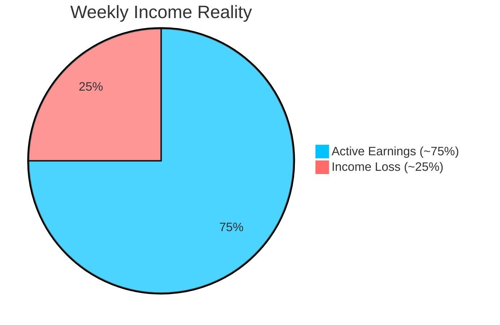
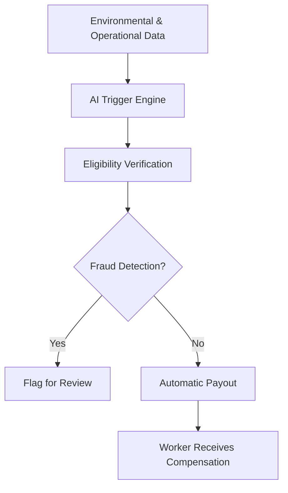

<b>Understanding the Problem</b> 
<i>Income instability in e-commerce delivery work</i>

---

# 📌 Problem Statement

E-commerce platforms like Amazon and Flipkart rely heavily on delivery partners for last-mile delivery.

But their income isn’t fixed.

They earn **per delivery**, which means:

👉 No deliveries = No income  

---

### ⚠️ The reality

Everyday conditions can suddenly stop their work:

- 🌧 Rain & floods  
- 🌡 Extreme heat  
- 🌫 Pollution  
- 🚧 Local restrictions  

When this happens, deliveries slow down or stop entirely.

---

---

# Why This Matters

India’s gig economy is growing fast — and e-commerce delivery is a big part of it.  

- Over **3.7 million delivery workers** rely on platforms like **Amazon, Flipkart, Swiggy, Zomato, Blinkit, Zepto**  
- Most depend on **daily earnings to survive**, meaning even **1–2 days of disruption** can hit their weekly income  
- External factors like **rain, floods, extreme heat, pollution, or local restrictions** can instantly stop deliveries  

Despite being essential, these workers have **no income protection**.  

ShieldGig aims to provide a **data-driven financial safety net** through **automated parametric insurance**.

---

# 🛡️ Proposed Concept: ShieldGig

ShieldGig is a **parametric micro-insurance platform** for e-commerce delivery gig workers.  
It provides **automatic payouts** when external disruptions affect earnings, without any manual claim process.

- Uses **environmental triggers** like heavy rain, floods, extreme heat, pollution, or local restrictions  
- **AI verifies worker activity** in the affected zone before releasing payouts  
- **Fraud detection** prevents misuse, ensuring fair and accurate compensation  
- **Automatic credit** of payouts reduces income instability for workers  

